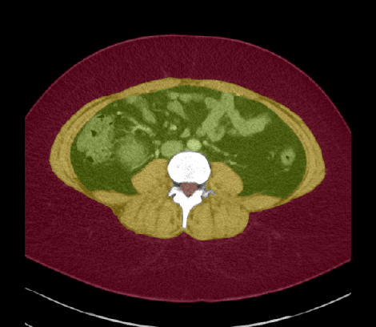
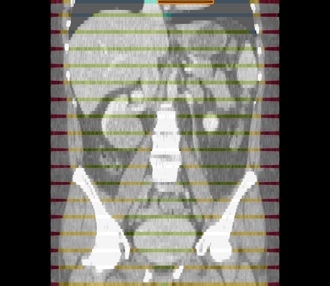
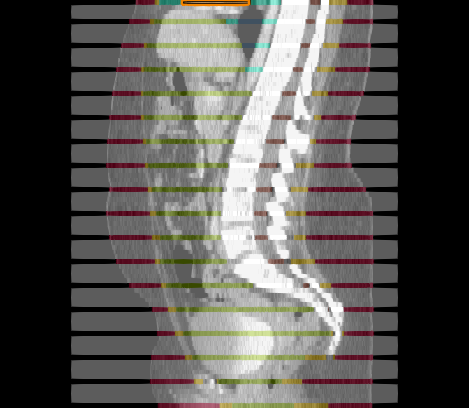

# Muscle, Subcutaneous and Visceral Fat Segmentation 

Code Repository for [Enhanced Muscle and Fat Segmentation for CT-Based Body Composition Analysis: A Comparative Study]().

<p align="center">
  &nbsp;&nbsp;
  
  &nbsp;&nbsp;
  
  &nbsp;&nbsp;
  
  &nbsp;&nbsp;
</p>

Series `case_042` obtained from [SAROS dataset](https://github.com/UMEssen/saros-dataset).

## Abstract

**Purpose**: Body composition measurements from routine abdominal CT can yield personalized risk assessments for asymptomatic and diseased patients. In particular, attenuation and volume measures of muscle and fat are associated with important clinical outcomes, such as cardiovascular events, fractures, and death. This study evaluates the reliability of an Internal tool for the segmentation of muscle and fat (subcutaneous and visceral) as compared to the well-established public TotalSegmentator tool. 

**Methods**: We assessed the tools across 900 CT series from the publicly available SAROS dataset, focusing on muscle, subcutaneous fat, and visceral fat. The Dice score was employed to assess accuracy in subcutaneous fat and muscle segmentation. Due to the lack of ground truth segmentations for visceral fat, Cohen's Kappa was utilized to assess segmentation agreement between the tools.

**Results**: Our Internal tool achieved a 3% higher Dice (83.8 vs. 80.8) for subcutaneous fat and a 5% improvement (87.6 vs. 83.2) for muscle segmentation respectively. A Wilcoxon signed-rank test revealed that our results were statistically different with p<0.01. For visceral fat, the Cohen's kappa score of 0.856 indicated near-perfect agreement between the two tools. Our internal tool also showed very strong correlations for muscle volume (R<sup>2</sup>=0.99), muscle attenuation (R<sup>2</sup>=0.93), and subcutaneous fat volume (R<sup>2</sup>=0.99) with a moderate correlation for subcutaneous fat attenuation (R<sup>2</sup>=0.45). 

**Conclusion**: Our findings indicated that our Internal tool outperformed TotalSegmentator in measuring subcutaneous fat and muscle. The high Cohen's Kappa score for visceral fat suggests a reliable level of agreement between the two tools. These results demonstrate the potential of our tool in advancing the accuracy of body composition analysis.

## Cite this work

```
@article{DBLP:journals/corr/submit/5340591,
  author       = {Benjamin Hou and
                  Tejas Sudharshan Mathai and
                  Jianfei Liu and
                  Christopher Parnell and
                  Ronald M. Summers},
  title        = {Enhanced Muscle and Fat Segmentation for CT-Based Body Composition Analysis: A Comparative Study},
  journal      = {CoRR},
  volume       = {submit/5340591},
  year         = {2024}
}
```
